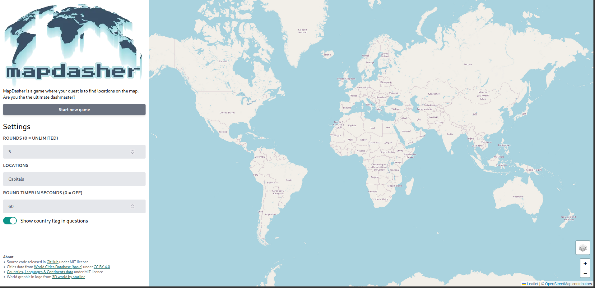
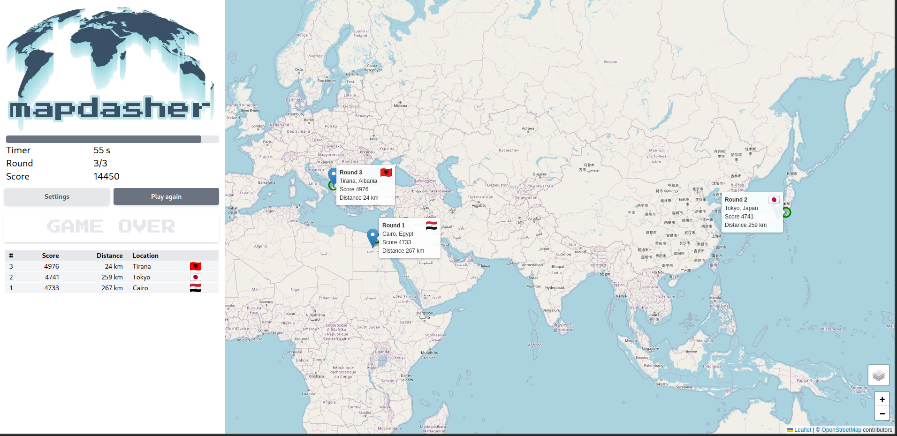
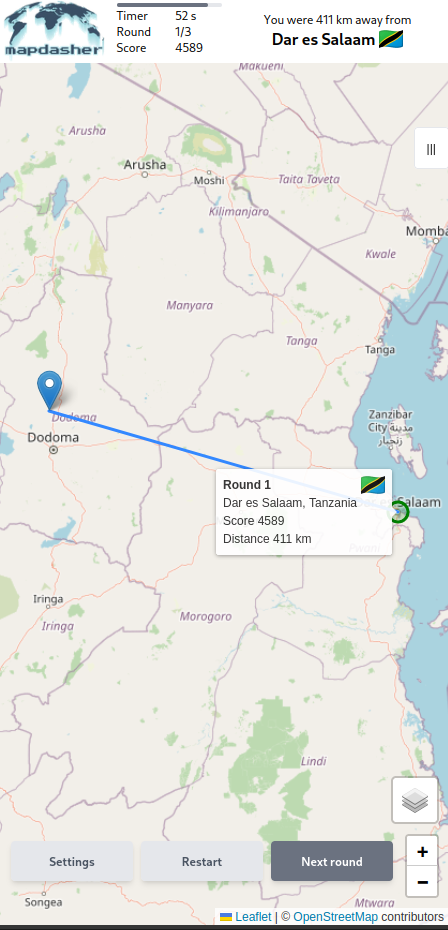

# MapDasher

[>> Play MapDasher](https://jhuttunen.github.io/mapdasher/)

## About the game

MapDasher is a game where you dash around map placing guesses

### Frontend
* [React](https://react.dev/) frontend deployed to [GitHub Pages](https://pages.github.com/)
* Responsive layout with [tailwindcss](https://tailwindcss.com/) framework
* [React-leaflet](https://react-leaflet.js.org/) map features utilized in many ways
* Game settings currently include
  * setting number of rounds
  * customizing asked locations
  * timer functionality
  * changing map style

### Backend
* [Express.js](https://expressjs.com/) backend API deployed to [Fly.io](https://fly.io/)
* Backend uses [PostreSQL](https://www.postgresql.org/) database deployded to [Fly.io](https://fly.io/)
* Database connection and model with [Prisma ORM](https://www.prisma.io/) 
* Basic [API documentation](https://github.com/jhuttunen/mapdasher/tree/main/server) in markdown format

## Screenshots

### Game settings

### Game play

### Responsive layout

## Possible future plans

* better scoring formula
* more different kinds of questions
* utilizing geoJson data in map
* user registration
* save rounds to database
* allow sharing of round with link
* top score rankings

## Attributions

* Location data modified from World Cities Database (basic) by [SimpleMaps.com](https://simplemaps.com/) licenced under [CC BY 4.0](https://creativecommons.org/licenses/by/4.0/)
* [Countries, Languages & Continents data](https://github.com/annexare/Countries) under MIT licence</li>
* World graphic in logo from [3D world by starline](https://www.freepik.com/free-vector/3d-globe-map-isolated-white-background_37205420.htm)
* Flag images from [Flagpedia.net](https://flagpedia.net//) are free to use public domain (exempt from copyright)
