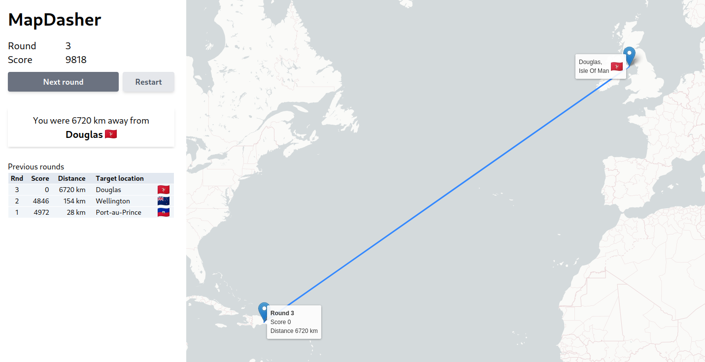
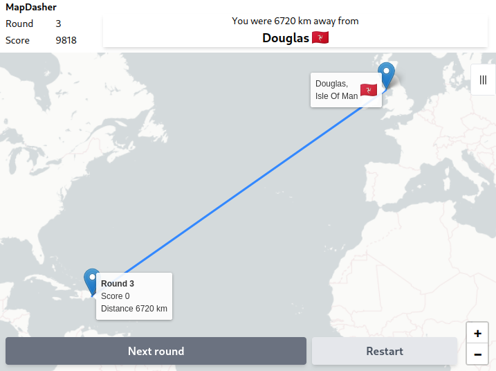

# MapDasher

[>> Play MapDasher](https://jhuttunen.github.io/mapdasher/)

## About the game

MapDasher is a game where you dash around map placing guesses

* frontend with [React](https://react.dev/) and deployed to [GitHub Pages](https://pages.github.com/)
* responsive layout with [tailwindcss](https://tailwindcss.com/)
* map features with [react-leaflet](https://react-leaflet.js.org/)
* backend API with [Express.js](https://expressjs.com/) currently deployed to [Fly.io](https://fly.io/)
* uses haversine to calculate distances between coordinates

## Screenshots

### Gameplay

### Responsive layout

## Possible future plans

* settings menu
  * difficulty
    * sandbox run or limited number of questions
    * more location choices (currently only world capitals)
    * limit questions to single country or continent
    * show/hide flags
    * map style with or without place names
    * timer on/off
* user registration
* database integration (PostreSQL?)
* save rounds to database
* allow sharing of round with link
* top score rankings

## Attributions

* Location data modified from World Cities Database (basic) by [SimpleMaps.com](https://simplemaps.com/) licenced under [CC BY 4.0](https://creativecommons.org/licenses/by/4.0/)
* Flag images from [Flagpedia.net](https://flagpedia.net//) are free to use public domain (exempt from copyright)
